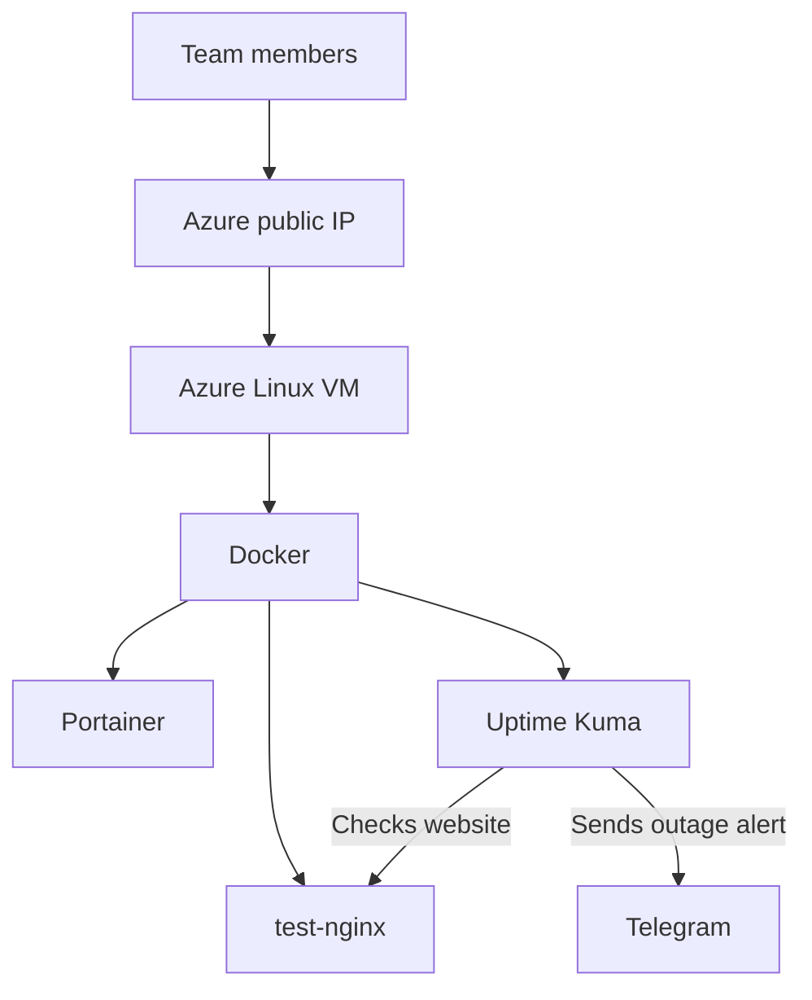

# Portainer on Azure

A team project that deploys a Linux virtual machine on Azure with Terraform,
runs containerized applications with Docker, and manages them through Portainer.
Uptime Kuma monitors a test website and sends Telegram alerts when it stops
responding.

## What we built

| Component | Purpose |
| --- | --- |
| Terraform | Defines the Azure VM, network, and access rules as code |
| Azure Linux VM | Hosts the project's containers |
| Docker and Docker Compose | Run and configure the containers |
| Portainer | Provides a web interface for container management |
| Uptime Kuma | Checks whether the test website responds |
| Telegram bot | Delivers monitoring alerts |

## Architecture

The VM is connected to an Azure virtual network and subnet. Network rules
restrict SSH (port 22) and Portainer HTTPS (port 9443) to the configured team
IP addresses.

## Repository contents

| Path | Contents |
| --- | --- |
| `terraform/` | Azure infrastructure configuration and example variables |
| `docker/` | Docker Compose configuration |
| `scripts/` | VM setup and utility scripts |
| `docs/` | Architecture, implementation notes, and screenshots |

## Requirements

To deploy the infrastructure, you need Terraform, Azure CLI, an Azure
subscription with the required permissions, and an SSH key pair for each team
member who needs VM access. Authenticate to Azure with `az login` before
running Terraform.

Use `terraform/terraform.tfvars.example` as a guide for local configuration.
Keep your actual `terraform.tfvars` out of Git.

## Implementation

1. Defined the Azure network, access rules, and Linux VM with Terraform.
2. Validated and deployed the infrastructure.
3. Installed Docker on the VM and ran Portainer.
4. Deployed a test Nginx container for the demonstration.
5. Deployed Uptime Kuma and configured it to check the test website.
6. Configured a Telegram bot to receive monitoring alerts.

## Demonstrated result

We tested the complete incident workflow:

1. `test-nginx` was running and Uptime Kuma reported **Up**.
2. We stopped the container in Portainer to simulate an outage.
3. Uptime Kuma reported **Down** and sent a Telegram alert.
4. We started the container in Portainer.
5. Uptime Kuma reported **Up** again.

Uptime Kuma detects and reports an outage; the team restores the service
through Portainer. Stopping the container is a controlled demonstration of
an outage, not an automatic recovery feature.

## Security

- VM access uses SSH keys.
- Azure network rules limit access to the configured team IP addresses.
- Uptime Kuma's web interface is reached through an SSH tunnel rather than
  an open public port.
- `terraform.tfvars`, Terraform state files, private SSH keys, passwords, and
  the Telegram bot token must not be committed to Git.